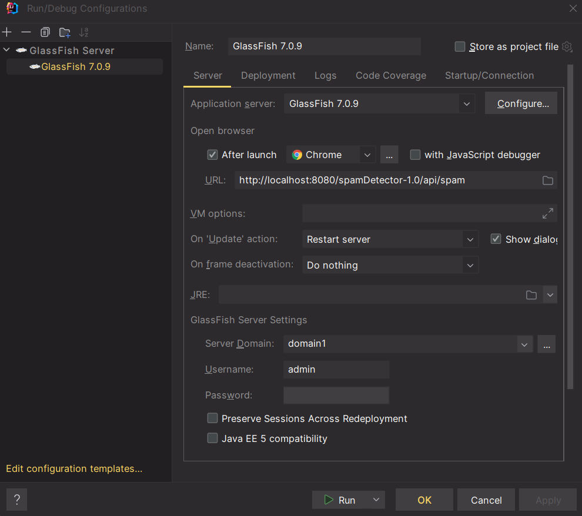
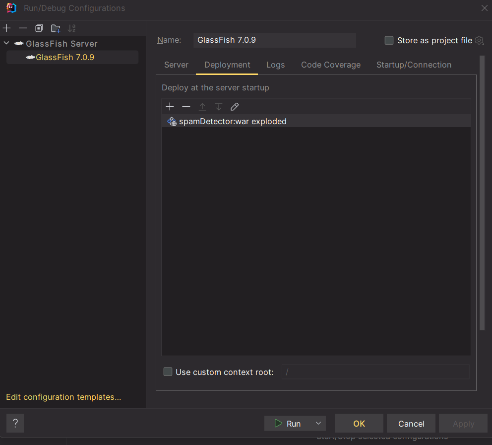
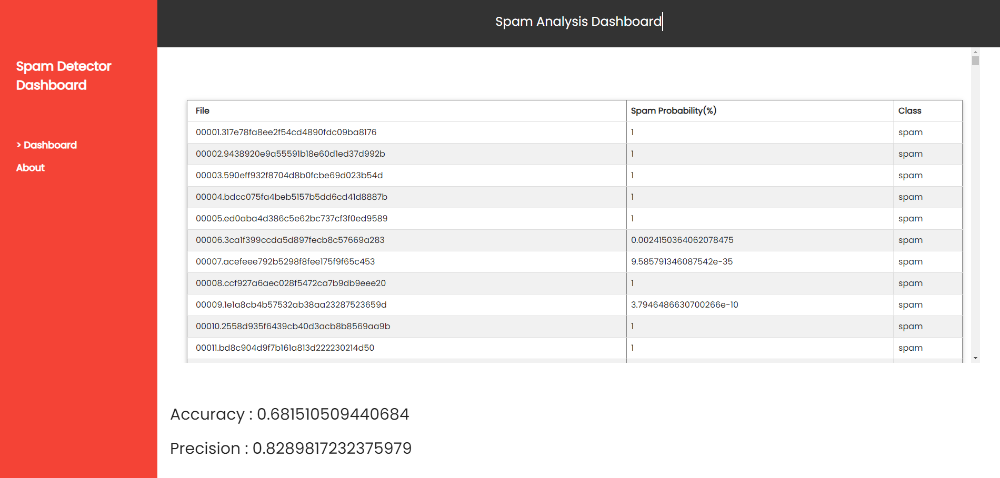

# Spam Detector
###### By Saksham Tejpal, Shiv Amin, Sanhith Amarathunge, Vibhavan Saibuvis

### Project Information
We have created a spam detector that takes in a dataset of emails and checks if they are spam or normal.
We have trained our program to use a unigram approach, and it works based on computing the frequency of each individual
word in the `spam` and `ham` emails. Our code classifies and distinguishes each word based on respective occurrences in
various files to analyse whether it is spam or not. We use the method, `getTrainProb`, which returns the `map` of 
probabilities based on word frequencies. It calls the method `getFrequency`to obtain the frequency of each word from 
our spam and ham files then calls the `calcProb` method to calculate said probabilities of each word being spam.
We then test our training model using our `test` method which returns us a probability of induvidual files from 
spam and ham folders. `testAndTrain` is employed to get results from `test` and return a list of TestFiles,
to be further used for calculating accuracy and precision by `getAccuracy` and `getPrecision` methods.

### How to Run
#### 1. Cloning
The easiest way to clone the entire project is obtaining the URL from GitHub and adding a new project from version
control using this URL (IntelliJ Feature). You can also clone the repository using Git Bash. First mount to your
projects folder, then type the following:
```
git clone https://github.com/OntarioTech-CS-program/w24-csci2020u-assignment01-shiv-saksham-vibhavan-sanhith.git
```
Once you clone the project, load the Maven settings when the prompt appears in IntelliJ.
#### 2. Set up Glassfish Configuration
Select Current File near the top right of IntelliJ IDE. Press the `+` button and add a `GlassFish local` server.
Ensure the fields (`URL` and `Server Domain`) within the configuration screen match below:


Switch to the deployment tab, and deploy the artifact as seen below.



Click Apply then OK. You have successfully set up the server and can now run it.
#### 3. Loading the Web Page
Once the server is running, in the `SpamDetectorClient` folder, run index.html in your internet browser.
If GlassFish is running then you should see the following (it may take a few moments to load):


You can view our precision and accuracy measurements above for the model.
Once on the webpage you can also click the about section to see our group member names!

### Improvements to the Model
We simplified repeated responses and blocks of code to more generalized functions to help with the processing and make
our code more efficient to run. One example of this is building the response objects in our `SpamResource.java`.
Our `test` function was designed in a specific way so the probability maps it processes are outside of loops. This means
the map is only produced and stored once and it can be reused as per the repeating steps of finding a file's probability
is spam. Hence this reduces processing. Our `getTrainProb` method was designed to take three directories and putting
them into two maps, then utilizing `calcProb` to calculate the word probability map in a seamless and optimal way.

### Libraries Used
We implemented the scanner library in order to parse the files and test extract individual words.
